# 08.06.2020, Montag

### 9:00 Uhr - Start Week5 Day1

## Anwesenheit

## Tagesablauf

- 9:00 Uhr: Friday Exercise + Media Queries + Transition + Keyframes
- 10:10 Uhr: Intro JavaScript + Übung: Calculator
- 13:00 Uhr: Lunch
- 14:00 Uhr: JavaScript Functions + Übung: Calculator als Function
- 15:45 Uhr: JavaScript Objects
- 17:45 Uhr: Ende

## Week Preview
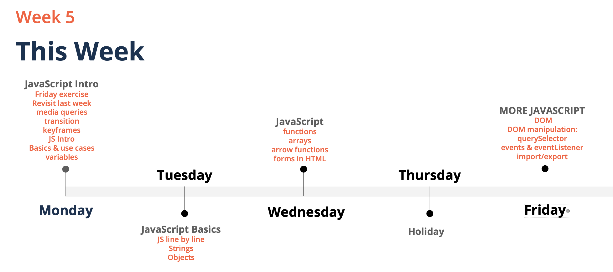

## Friday Exercise - Kurzer Recap

Bootstrap und JavaScript: 
Ohne die Einbindung von JavaScript ist keine Animation in Bootstrap möglich -> Funktionalitätsverlust (z.B. Nav-Bar). 
Marwin erklärt, wie man JS bei Bootstrap einbindet (Bootstrap -> "Getting Started").

HTML Setup mit Bootstrap (inkl. JavaScript)  

    <!doctype html>
    <html lang="en">
      <head>
        <!-- Required meta tags -->
        <meta charset="utf-8">
        <meta name="viewport" content="width=device-width, initial-scale=1, shrink-to-fit=no">
    
        <!-- Bootstrap CSS -->
        <link rel="stylesheet" href="https://stackpath.bootstrapcdn.com/bootstrap/4.5.0/css/bootstrap.min.css" integrity="sha384-9aIt2nRpC12Uk9gS9baDl411NQApFmC26EwAOH8WgZl5MYYxFfc+NcPb1dKGj7Sk" crossorigin="anonymous">
        
        <!-- Eigene CSS-Dateien -->
        
        <title>Hello, world!</title>
      </head>
      <body>
        <h1>Hello, world!</h1>
    
        <!-- Optional JavaScript -->
        <!-- jQuery first, then Popper.js, then Bootstrap JS -->
        
        
        
      </body>
    </html>

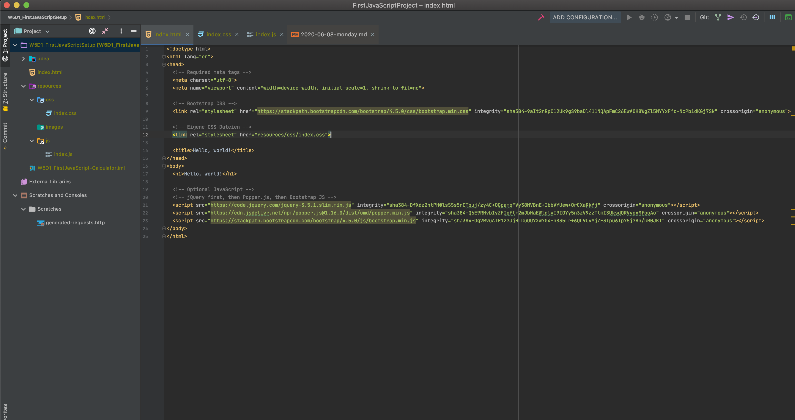

## Media Queries
https://developer.mozilla.org/de/docs/Web/CSS/Media_Queries/Using_media_queries

Abfragen in CSS: Die Abfragen erfassen die Breite des Bildschirms (View Width) und passen den Inhalt an die Bildschirmbreite an. 
Definiert, was passieren soll, wenn die Regel `true` zurückgibt. Wird hauptsächlich verwendet, um Layout anzupassen. 
Wird in Grid-System verwendet. Manipuliert Anordnung von Grid (Greift z.B. in die Anzahl von colums und rows ein).

Ein Media Query besteht aus einem media-Type und mindestens einer Expression, die den Scope des Stylesheets durch Nutzung 
von Features wie `widht`, `height`, `color` limitiert. Media Queries, die in CSS3 hinzugefügt werden, passen die Darstellung
des Inhaltes automatisch an bestimmte Output-Devices an, ohne dass man den Inhalt selbst ändern muss. 

Die @media CSS-@-Regel kann benutzt werden, um Teile des Stylesheets basierend auf den Ergebnissen von einer oder mehreren 
Media-Queries anzuwenden. Mit dieser Regel spezifiziert man eine Media Query und einen CSS Block so, dass dieser nur dann 
angewandt wird, wenn die Media Query das Device matched.

Beispiele:
    
    @media print {
      body { font-size: 10pt; }
    }
    
    @media screen {
      body { font-size: 13px; }
    }
    
    @media screen, print {
      body { line-height: 1.2; }
    }
    
    @media only screen 
      and (min-width: 320px) 
      and (max-width: 480px)
      and (resolution: 150dpi) {
        body { line-height: 1.4; }
    }

## Transition am Beispiel des `button`-Elements
https://developer.mozilla.org/de/docs/Web/CSS/transition#

Die transition CSS Eigenschaft ist eine Kurzschreibweise für `transition-property`, `transition-duration`, `
transition-timing-function` und `transition-delay`.

Wird benutzt, um Änderungen Zeit zu geben. "Delay" für Animationen. Legt fest, wie viel Zeit die Veränderung einer 
Property in Anspruch nehmen soll.

Beispiel an Button in CodePen. 

#### Button Eigenschaft:

    transition: all 0.5s;

#### Alternative 1:

    transition: border 0.5s;

#### Alternative 2:
    transition: transform 0.5s, border 1s;
  
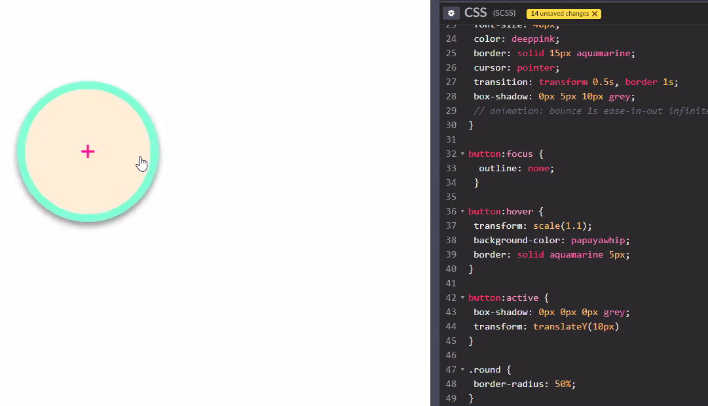

#### Simple Example

    #delay {
      font-size: 14px;
      transition-property: font-size;
      transition-duration: 4s;
      transition-delay: 2s;
    }
    
    #delay:hover {
      font-size: 36px;
    }

#### Multiple Animated Properties Example

    .box {
        border-style: solid;
        border-width: 1px;
        display: block;
        width: 100px;
        height: 100px;
        background-color: #0000FF;
        transition: width 2s, height 2s, background-color 2s, transform 2s;
    }
    
    .box:hover {
        background-color: #FFCCCC;
        width: 200px;
        height: 200px;
        transform: rotate(180deg);
    }

## Pseudo-Klassen (focus, hover und active)
https://wiki.developer.mozilla.org/en-US/docs/Web/CSS/Pseudo-classes

Eine CSS Pseudo-Klasse ist ein Keyword, dass einem Selector hinzugefügt wird, welches einen speziellen Zustand eines oder 
mehrerer ausgewählten Elemente spezifiziert. z.B. kann `hover` dazu benutzt werden, um die Farbe eines Buttons zu ändern, 
sobald man mit dem Mauszeiger darüber fährt. Pseudo-Klassen ermöglichen einen Style an einem Element anzuwenden.
Ebenfalls ist es möglich in Abhängigkeit von externen Faktoren wie z.B. die History des Navigators (zum Beispiel mit `:visited`), den 
Status des Inhalts (z.B. mit `:checked` bei bestimmten Form-Elementen) oder die Maus-Position (z.B. mit `:hover`, was 
einen wissen lässt, ob die Maus über einem Element ist oder nicht).

#### Syntax

    selector:pseudo-class {
      property: value;
    }

#### Examples

    button:focus { ... }
    button:hover { ... }
    button:active { ... }
    
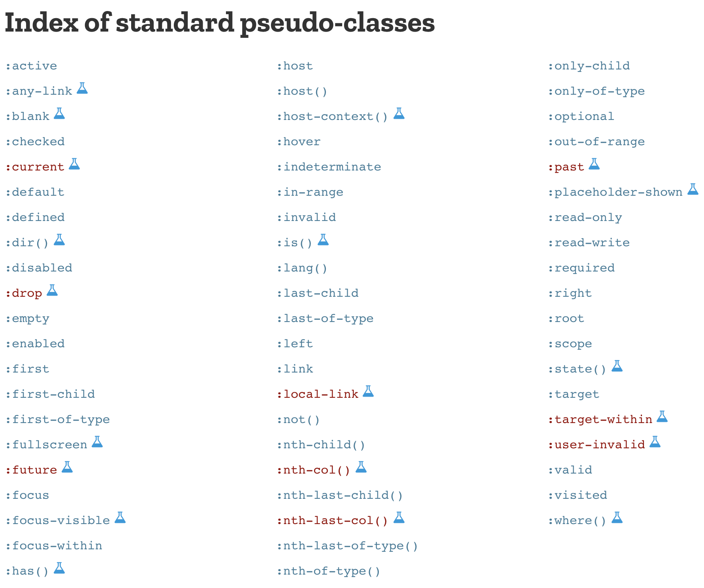

### Hover-Funktion CSS
https://developer.mozilla.org/de/docs/Web/CSS/hover

    button:hover {
        background-color: papayawhip;
        border: solid aquamarine 5px;
        }

## Transform - Bsp. Mozilla Firefox Logo
https://developer.mozilla.org/de/docs/Web/CSS/transform

Zur Manipulation der Lage von Bildern / Effekte für Bilder.

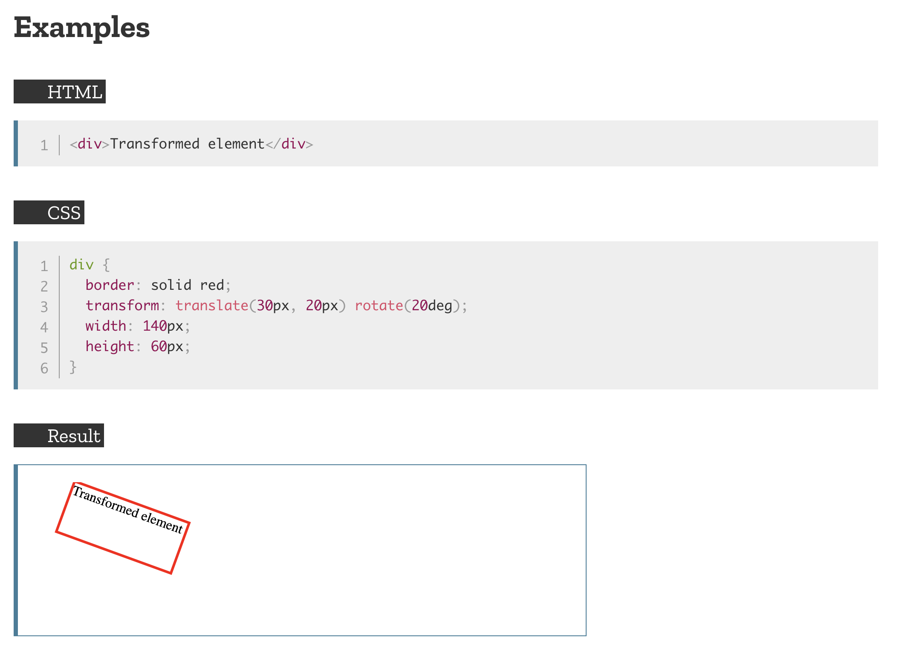

## Animationen
https://developer.mozilla.org/en-US/docs/Web/CSS/animation

Für Details bitte in die Documentary schauen.

Bestimmte Dinge können nicht animiert werden. z.B. in Grid.

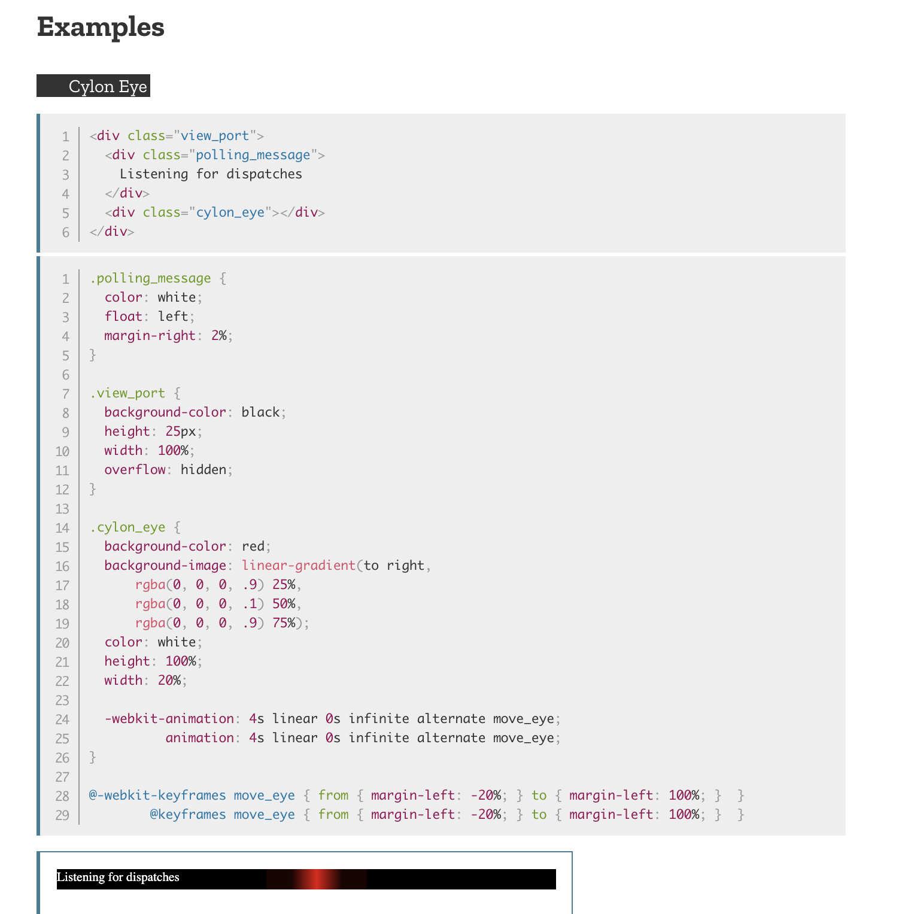
(Der rote Balken bewegt sich wie bei Kit von Knight-Rider)

### Animation-Iteration-Count
(bei Nutzung der `animation`-Property obsolet)
https://wiki.developer.mozilla.org/en-US/docs/Web/CSS/animation-iteration-count

Mit der Animation-Iteration-Count CSS Eigenschaft setzt man die Häufigkeit fest, die ein Animations-Zyklus durchlaufen 
soll, bevor er stoppt. Wenn mehrere Werte spezifiziert wurden, wird bei jedem Mal wenn die Animation abgespielt wird der 
nächstfolgende Wert in der Liste benutzt. Nach dem Abspielen des letzten Wertes springt die Schleife wieder zum ersten 
Element in der Liste. Es ist jedoch komfortabler die `animation`-Eigenschaft (Kurzschreibweise s.o.) zu nutzen und alle 
Animations-Eigenschaften gleichzeitig zu setzen. 

## Keyframes 
https://developer.mozilla.org/de/docs/Web/CSS/@keyframes

Durch die CSS-at-Regel @keyframes kann der Autor die einzelnen Schritte einer CSS-Animationssequenz festlegen, indem er 
Keyframes (oder Wegpunkte) setzt, die während der Sequenz an bestimmten Punkten erreicht werden. Das ermöglicht eine 
spezifischere Kontrolle über die Zwischenschritte einer Animationssequenz gegenüber dem Ergebnis einem dem Browser 
überlassenen, automatisch berechneten Ablauf.

#### Syntax
(für konkrete Beispiele in die Docu schauen)

    @keyframes property {
        ...
        }

#### Beispiele von Marwin

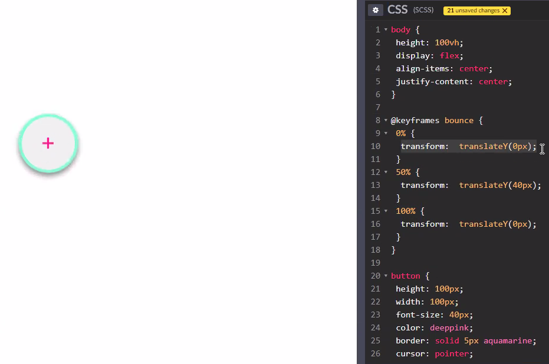  

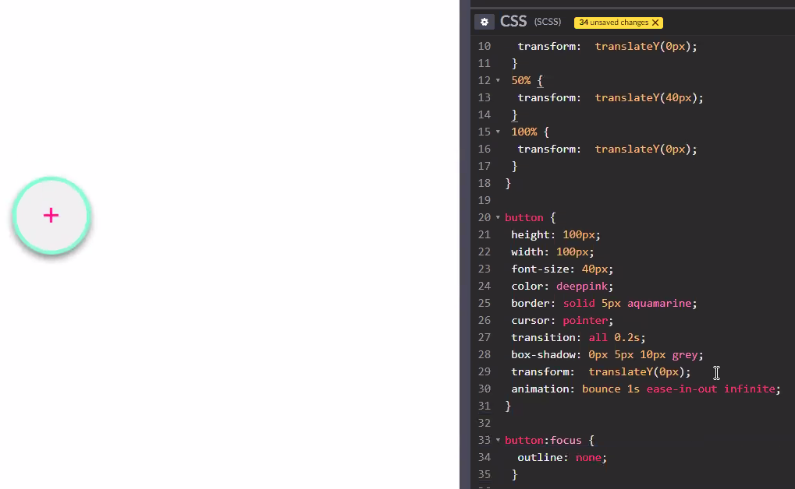

## JavaScript Intro

### Was ist JavaScript?
JavaScript ist eine Script- bzw. eine Programmier-Sprache, die einem erlaubt auf einer Webseite komplexe Features zu 
implementieren. Jedes Mal, wenn eine Webseite mehr macht, als nur da zu sitzen und statischen Inhalt anzuzeigen, den man 
angucken kann, ist sehr Wahrscheinlich JavaScript involviert (z.B. Anzeigen von zeitlichen Inhalt-Updates, Interaktive Karten, 
animierte 2D/3D Grafiken, etc.). Es ist die 3. Ebene der Ebenen-Struktur von Standard-Web-Technologien. Die anderen beiden 
sind HTML und CSS.

- Scripting Language
- Standard von Scripting Languages: ECMAScript
- Wir arbeiten mit ES6: ECMA Script 6 - Wird von so ziemlich allen bekannteren Browsern unterstützt
- V8-Engine: Google's JavaScript Engine - Wird zB. von Browsern benutzt

### Warum JavaScript?
- Event driven
- Wenn DOM über Chrome DevTool manipuliert wird, passiert das sofort auf dem Bildschirm
- Multi-einsatzfähig: Web-Apps, Tools, Plugins, etc.
- Server-Side Rendering & APIs: Statische HTML-Seiten vom Server generiert, die vom Browser nur noch interpretiert 
werden müssen. #Geschwindigkeit

## JavaScript: Variablen
### Beispiele von Marwin

### Javascript.info
Wir lesen die Sektionen:  
- Variables: https://javascript.info/variables
- Interaction: https://javascript.info/alert-prompt-confirm
- Type Conversions: https://javascript.info/type-conversions
- Basic operators, math: https://javascript.info/operators
- Comparison: https://javascript.info/comparison
- Function Basics: https://javascript.info/function-basics

### Data Types
- Number (bigInt)
- String
- Boolean: true & false
- "null": nicht existent & "undefined": nicht definiert
- Objects
- Symbol Objects

### Beispiel Code-Snippets
Typ-Zuweisung  

    let highscore = 123456; // Deklariert Variable highscore und weißt Wert 123456 zu.

    console log(typeof highscore); // Ließt Typ von highscore aus. Hier: number/int
    highscore = Script(highscore); // Konvertiert Variable highscore in einen String.
    console log(typeof highscore); // Liest Typ von highscore aus. Jetzt: String

### Setup JavaScript-Project in IntelliJ

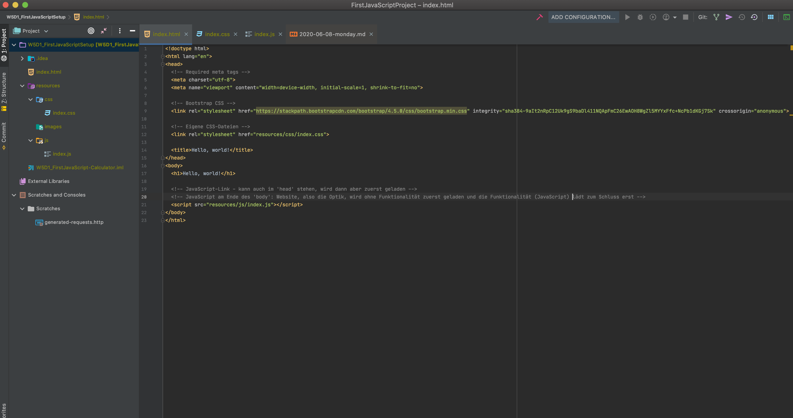

### Task: Calculator
index.js-Datei:

    let number1 = Number(prompt("Please Enter your first number:", ""));
    let operator = prompt("Please enter an operator:", "");
    let number2 = Number(prompt("Please enter your second number:", ""));
    let result;
    
    if (operator === "*") {
        result = number1*number2;
    } else if (operator === "/" && number2 !== 0) {
        result = number1/number2;
    } else if (operator === "+") {
        result = number1+number2;
    } else if (operator === "-") {
        result = number1-number2;
    } else {
        result = "This operator does not exist! Please enter one of the following symbols: */+-";
    }
    
    alert("The result ist: " + result);

## JavaScript: Functions

#### Komponenten
Struktur quasi identisch zu Java
- function head
    - keyword: `function` 
    - name
    - parameter(s): in runden Klammern
- function body: in geschweiften Klammern

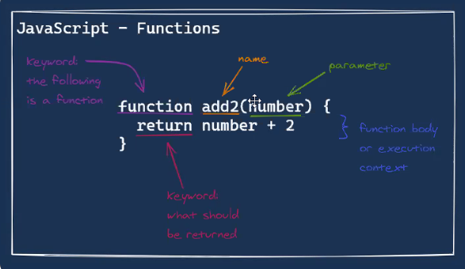

#### Function Call
Ähnlich wie bei Java nur ohne Objekte/Klassen, die vorangestellt werden.
Und man muss das Keyword  `function` voranstellen.

    function add2(numer){
        return nunber + 2;
        }
        
    add2(number: 4); // function call

### Javascript.info
Wir lesen die Sektionen:  
- Function-Basics: https://javascript.info/function-basics
- Function-Expressions: https://javascript.info/function-expressions

### Task: Calculator - Function-Version
index.js-Datei:

    let number1 = Number(prompt("Please Enter your first number:", ""));
    let operator = prompt("Please enter an operator:", "");
    let number2 = Number(prompt("Please enter your second number:", ""));
    let result;
    
    function calculate(number1, number2, operator){
        if (operator === "*") {
            result = number1*number2;
        } else if (operator === "/" && number2 !== 0) {
            result = number1/number2;
        } else if (operator === "+") {
            result = number1+number2;
        } else if (operator === "-") {
            result = number1-number2;
        } else {
            result = "This operator does not exist! Please enter one of the following symbols: */+-";
        }
        return result;
    }
    
    alert("The result ist: " + calculate(number1, number2, operator));

### Task: Calculator - Marwin's Function-Version (switch-case solution)

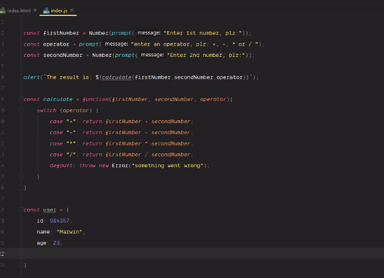

### Callback Function

Wir schreiben eine Funktion ask(question, yes, no) mit 3 Parametern:

question: Text of the question (a String)  
yes: Function1 -> runs if the answer is "yes"  
no: Function2 -> runs if the answer is "no"

Die Funktion ask() soll die Frage stellen. Abhängig von der Antwort des Nutzers soll dann wiederum die Funktion yes () 
oder no() aufgerufen werden:

    function ask(question, yes, no) {
      if (confirm(question)) yes()
      else no();
    }
    
    function showOk() {
      alert( "You agreed." );
    }
    
    function showCancel() {
      alert( "You canceled the execution." );
    }
    
    // usage: functions showOk, showCancel are passed as arguments to ask
    ask("Do you agree?", showOk, showCancel);

In der Praxis sind solche Funktionen sehr nützlich. Der Hauptunterschied zwischen einer Real-Life-Frage und dem Beispiel 
oben ist, dass Real-Life-Funktionen komplexere Wege nutzen, um mit dem User zu interagieren, als mittels einer einfachen 
Bestätigung. Im Browser rufen diese Funktionen in der Regel ein Frage-Fenster auf. 

Die beiden Funktionen `showOK` und `showCancel` innerhalb der ask()-Funktion werden "callback functions" oder einfach 
"callbacks" genannt.  

Wir können Funktions-Ausdrücke benutzen, um die gleiche Funktion kürzer zu schreiben:

    function ask(question, yes, no) {
      if (confirm(question)) yes()
      else no();
    }
    
    ask(
      "Do you agree?",
      function() { alert("You agreed."); },
      function() { alert("You canceled the execution."); }
    );

Hier werden die Funktionen direkt innerhalb des Aufrufes von ask() deklariert. Sie haben keinen Namen und werden deshalb 
"anonym" genannt. Solche Funktionen sind außerhalb von ask() nicht zugänglich (weil sie nicht Variablen zugeordnet werden), 
aber genau das ist hier so gewünscht. 

## JavaScript: Objects
Die Struktur ist ähnlich wie bei Klassen in Java (Klassen haben Eigenschaften. Objekte übernehmen diese Eigenschaften 
implizit. Bei JavaScript Eigenschaften und konkrete Werte der Objekte in einem. Sprich, man sieht hier konkret, welche 
Werte den Attributen / Eigenschaften eines Objektes zugewiesen werden.

#### Komponenten
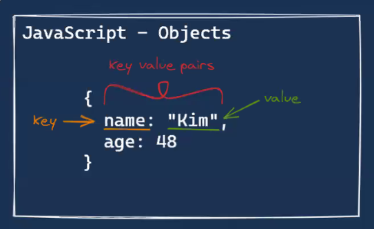

#### Example

    let user = {     // an object
      name: "John",  // by key "name" store value "John"
      age: 30        // by key "age" store value 30
    };

Das Objekt { ... } wird der Variablen `user` zugeordnet. Sprich:`user`ist eine Variable vom Typ Objekt.

#### Marwin's Examples
Simples Objekt mit den Eigenschaften `id`, `name` und `age`. Über `const keyName = "name"` wird der Wert der Eigenschaft
`name` des Objektes in der Konstante `keyName` gespeichert. Dann wird über `alert` dieser Name aufgerufen und ausgegeben. 
Warum Marwin nicht direkt `alert(user.name)` aufruft und den Namen vorher in `keyName` abspeichert, erschließt sich mir 
nicht, da beides geht und mir `alert(user.name)` sinnvoller erscheint.  
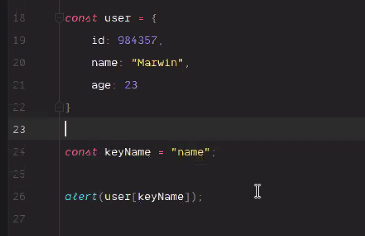

Hier erweitert Marwin das Objekt `user` um ein weiteres inneres Objekt (#Inception) und ruft mit `alert(user.address.city)` 
den unter `city` gespeicherten Wert `Cologne` auf.  
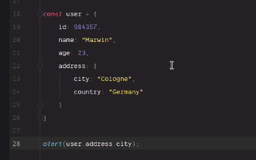

Marwin demonstriert hier, dass Objekte auch in sich weitere Objekte verschachteln können, was jedoch nicht der 
Übersichtlichkeit dienlich ist.  `user = {id, name, age address { city { name, province } }, country }`  
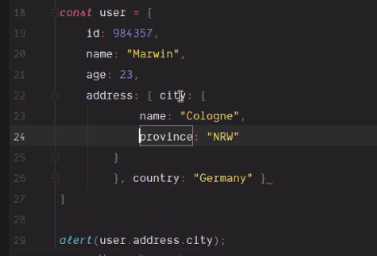

#### Javascript.info
Wir lesen die Sektionen:  
- Objects: https://javascript.info/object

#### Property "onclick" 
(Objekt-Eigenschaften mittels Funktionen ändern/setzen)
Beispiel: 

    <button onclick="changeUserName()"></button>

HTML-Button bekommt eine JavaScript-Funktion hinterlegt, die beim "Klicken" des Buttons aufgerufen wird.

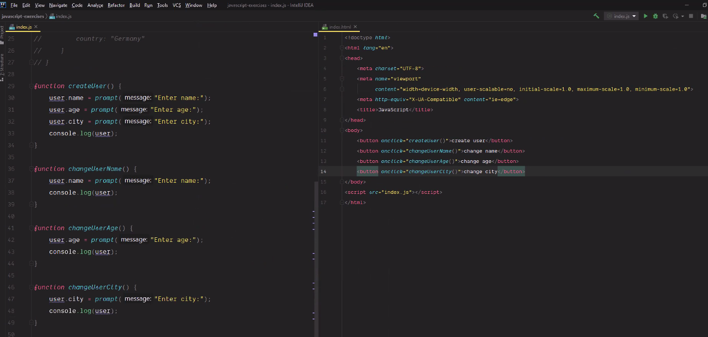

## Resources
- Slides Week5: https://docs.google.com/presentation/d/1sGI_AE5HBhx8T1q42Z2MO9iGzcwtjvdA-USMwHl7upA/edit#slide=id.p5
- Mozilla Developers' Network: https://developer.mozilla.org/de/
- JavaScript Info: https://javascript.info/
